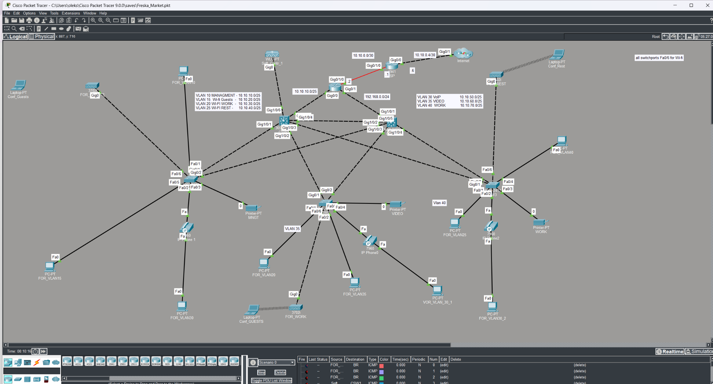

# Freska Market — segmented supermarket network (Cisco Packet Tracer)



An educational network design for a supermarket with seven functional VLANs, redundant switching links, wireless clients, IP telephony, DHCP, router subinterfaces, PAT, and a management access policy. The topology and evidence shown here belong to this lab.

## Address plan

| VLAN | Function | Network | Router gateway |
| ---: | --- | --- | --- |
| 10 | Management | `10.10.10.0/25` | `10.10.10.1` |
| 15 | Guest Wi-Fi | `10.10.20.0/25` | `10.10.20.1` |
| 20 | Work Wi-Fi | `10.10.30.0/25` | `10.10.30.1` |
| 25 | Rest Wi-Fi | `10.10.40.0/25` | `10.10.40.1` |
| 30 | VoIP | `10.10.50.0/25` | `10.10.50.1` |
| 35 | Video | `10.10.60.0/25` | `10.10.60.1` |
| 40 | Workstations | `10.10.70.0/25` | `10.10.70.1` |

BR connects to ISP across `10.10.0.0/30` (`10.10.0.2` ↔ `10.10.0.1`). ISP also has a separate `10.10.0.4/30` connected network. BR supplies the VLAN gateways using IEEE 802.1Q subinterfaces: VLANs 10–25 on `Gi0/0`, VLANs 30–40 on `Gi0/1`.

## Implementation and evidence

| Component | Implemented / observed | Evidence |
| --- | --- | --- |
| Switching | VLAN membership and selective trunk allowed lists on CSW1, CSW2, SW1–SW3 | [Sanitized configurations](configs/) |
| Edge ports | PortFast and BPDU Guard on configured client ports | [SW1](configs/SW1.txt), [SW2](configs/SW2.txt), [SW3](configs/SW3.txt) |
| STP | Rapid-PVST on central switches; root/port roles observed in CLI | [CSW1](evidence/05-stp-csw1.png), [CSW2](evidence/06-stp-csw2.png) |
| DHCP | Seven pools and client leases across the VLAN subnets visible in BR CLI capture; Option 150 appears in the supplied BR configuration screenshots but is not included in the repository images | [Bindings](evidence/03-dhcp-bindings.png) |
| Routing | BR 802.1Q gateways and default route toward ISP documented in supplied BR configuration screenshots | BR configuration screenshots pending safe redaction |
| PAT | Overload using BR WAN address; dynamic translations visible for management clients | [NAT/ACL](evidence/02-nat-and-acl.png) |
| Management ACL | `PROTECT_VLAN10` configured; deny counter observed | [NAT/ACL](evidence/02-nat-and-acl.png) |
| Wi-Fi | Client association lines visible in Packet Tracer topology | [Topology](evidence/01-network-topology.png) |

**Evidence boundary:** A configured DHCP pool or ACL is distinct from a successful end-to-end client test. The captures demonstrate DHCP bindings, some NAT translations, and ACL matches; they do not establish Internet access for every VLAN, voice call completion, or successful guest isolation in every direction.

## Verification checklist

- [x] Check VLANs, access-port assignments and trunk allowed lists in available switch configurations.
- [x] Inspect PortFast/BPDU Guard and configured STP priorities.
- [x] Review captured operational spanning-tree roles on CSW1 and CSW2.
- [x] Review captured BR DHCP bindings spanning the seven network ranges.
- [x] Review captured PAT translations and management ACL hit counter.
- [ ] Export and sanitize the complete BR running configuration as text.
- [ ] Verify actual ACL attachment on the *active* `Gi0/1.30`, `.35`, `.40` interfaces. Earlier BR screenshots show policy/NAT on unused `Gi0/0.30`, `.35`, `.40` subinterfaces while gateways reside on `Gi0/1`.
- [ ] Test approved inter-VLAN paths and blocked access to Management VLAN from each non-management VLAN.
- [ ] Verify PAT from each VLAN with traffic generation and `show ip nat translations`.
- [ ] Test client DNS and Internet reachability independently; inspect BR/ISP routes.
- [ ] Verify phone registration/calling and actual Wi-Fi client addressing and reachability.

### Suggested Packet Tracer checks

```text
show vlan brief
show interfaces trunk
show spanning-tree root
show spanning-tree vlan 10
show ip interface brief
show ip route
show ip dhcp binding
show access-lists
show ip nat translations
show ip nat statistics
```

## Files and limitations

- [`configs/`](configs/) contains **redacted reference outputs**, not paste-ready replacement configurations. Login credentials and the lab banner have been removed. BR configuration was supplied as screenshots, so no complete BR text configuration is claimed here.
- [`evidence/`](evidence/) contains five project screenshots. The newer topology screenshot with visible wireless associations replaces the original overview. A sixth screenshot was removed from the current tree because it displayed a credential hash; it remains in this private repository's history, so the repository must not be made public without replacing that history.
- The original `.pkt` was withheld from the repository because Packet Tracer project files can embed recoverable lab credentials. A credential-rotated copy can be added after checking it in Packet Tracer.

This is a simulated educational environment; it does not imply deployment in a production supermarket.
